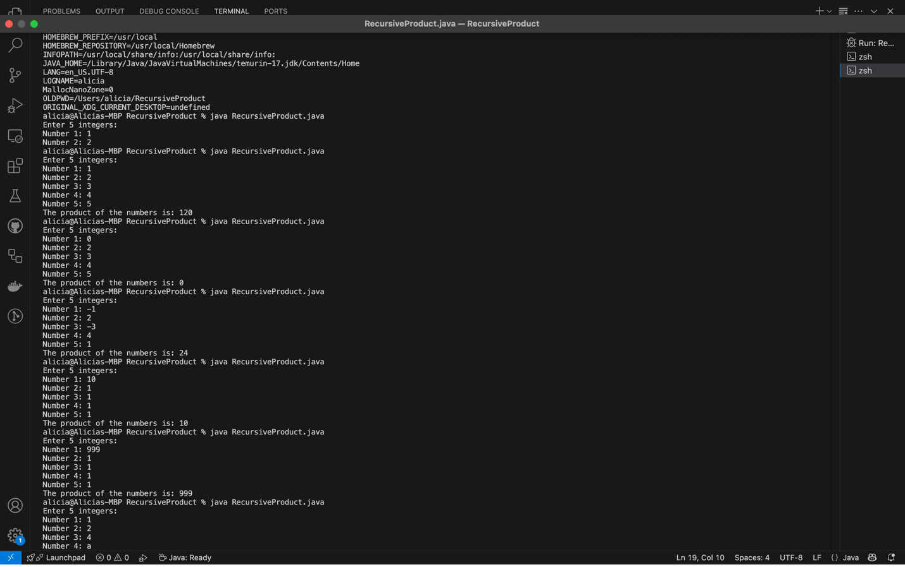

# Recursive Product in Java

This program calculates the product of five integers entered by the user using recursion. It features modularized functions and proper input validation.

## Program Overview

- Prompts the user for 5 integers
- Uses a recursive function to compute the product
- Modular code with Javadoc documentation

## Screenshots

### 1. Source Code in Visual Studio Code


### 2. Program Output in Terminal



## 🔧 How to Run

1. Compile:

   ```bash
   javac RecursiveProduct.java
   ```
